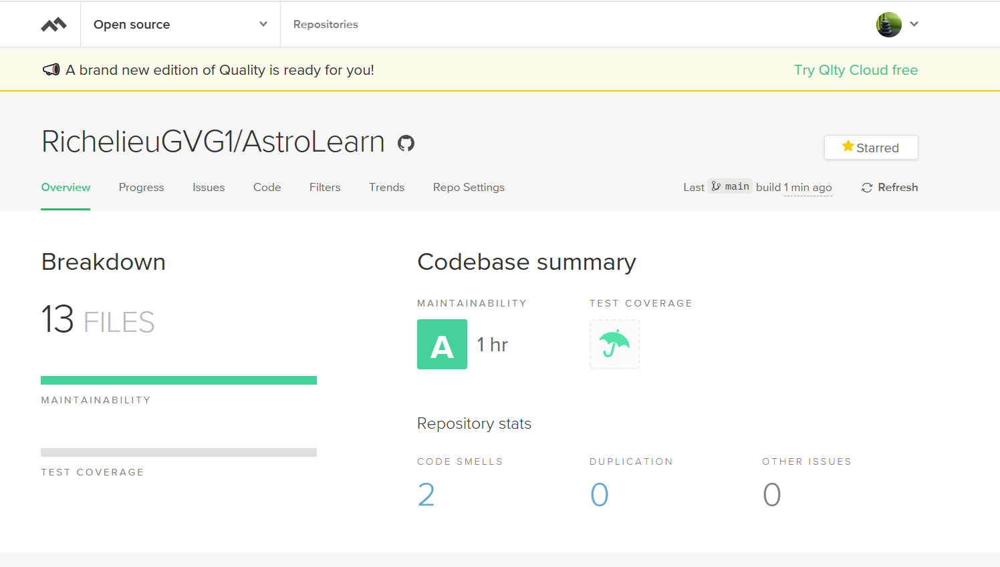

Лабораторная №1 по дисциплине "Методология разработки ПО"
Выполнил: Василий Гурьянов

Группа: БИВТ-22-СП-5

выбор игры осуществляется с помощью флага --game при запуске. Например:
---
python game.py --game lcm для игры в НОК.
python game.py --game progression для игры с геометрической прогрессией.
---
линтер питон: https://github.com/PyCQA/flake8

